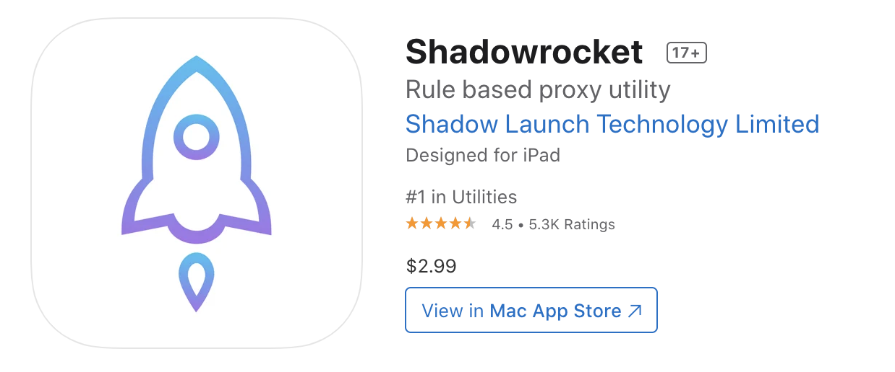

# 3.0 前提条件

[🔙 返回主指南](../README.md)

在正式开始购买RWA美股之前，你需要将所有准备工作做在前面。Web3 是一个极其冷酷的“黑暗森林”，没有客服可以帮你挽回操作失误。因此，作为完全零基础的小白，你必须严格按照以下三个步骤依次完成前置准备。

---

### 一、 身份证明准备（KYC）

在合规的数字资产世界里，第一步是证明“你是谁”。这个过程被称为 **KYC**。

> **💡 名词解释：KYC（Know Your Customer，了解你的客户）**
> 金融机构为了防范洗钱、身份冒用等违法行为，依法对客户进行实名认证的流程。

1. **准备有效证件**：准备好你本人的**二代身份证**。如果计划参与一些限制严格、仅对非中国大陆居民开放的境外一级市场 RWA 铸造，则需要准备有效期内的**个人因私护照**。
2. **确保本人操作**：在后续的认证流程中，会有严格的**人脸识别（活体检测）**。必须由你本人亲自在光线充足、背景干净的环境下完成操作。

---

### 二、 网络环境与海外账号（防钓鱼）

国内网络环境下，大部分合规的海外交易所及 Web3 钱包（如 MetaMask、OKX App）在应用商店是无法直接搜索下载的。这需要你配置特定的网络环境与海外应用商店。

> **💡 名词解释：机场与节点**
> “机场”是对提供网络代理服务平台的俗称，它集成了多条跨境专用线路（即节点）。通过配置代理客户端，你的设备就能“借道”这些海外节点顺畅访问海外网络。

1. **准备境外应用商店账户**：
   * **iOS（苹果手机）用户**：你需要注册或购买一个**港区、美区或新加坡等境外 Apple ID**。在 App Store 中退出国区账户，登录该境外 Apple ID 即可直接安全下载 Shadowrocket、币安、欧易、MetaMask 等官方客户端。
   * **Android（安卓手机）用户**：最安全的方式是准备一个 **谷歌商店（Google Play）账号**。若直接下载安装包，必须通过其官网提供的官方渠道下载，严禁使用搜索引擎中前几位的广告、推广链接（大概率是欺诈软件）。

2. **搭建安全的网络通道**：
   * **获取订阅**：首先注册并订阅一个稳定、可靠的代理节点服务商（俗称“机场”），获取订阅配置链接。
   * **电脑与安卓端**：下载 **Clash** 客户端（推荐使用更稳定、持续更新的官方开源分支版本：[Clash Verge Rev Releases 下载页面](https://github.com/clash-verge-rev/clash-verge-rev/releases)）或 **V2ray**（如 v2rayN）等。
   * **苹果 iOS 端**：使用上面准备好的境外 Apple ID 下载 **Shadowrocket**（俗称“小火箭”）。
     
     
     
     *⚠️ 注意：请务必仔细核对软件发行商（Developer），确认发行者是否为：**shadow launch technology limited**。千万不要在国区 App Store 下载，几乎全是骗钱的高仿软件。*
   * **启动运行**：将机场的订阅链接复制并导入客户端中，开启系统代理。

---

### 三、 安全防护工具准备（2FA）

为了防止你的交易账户因密码泄露而被盗，你必须启用双重身份验证。

> **💡 名词解释：2FA（Two-Factor Authentication，双重身份验证）**
> 除了用户名和密码之外，登录时还必须输入专门安全软件生成的动态随机密码，以此大幅增加账户安全性。

1. **下载谷歌验证器**：在手机应用商店中下载并安装 **Google Authenticator（谷歌验证器）**。这个软件不依赖网络，它每 30 秒会自动生成一个全新的 6 位数随机验证码。验证器密钥会自动绑定你的谷歌邮箱。
