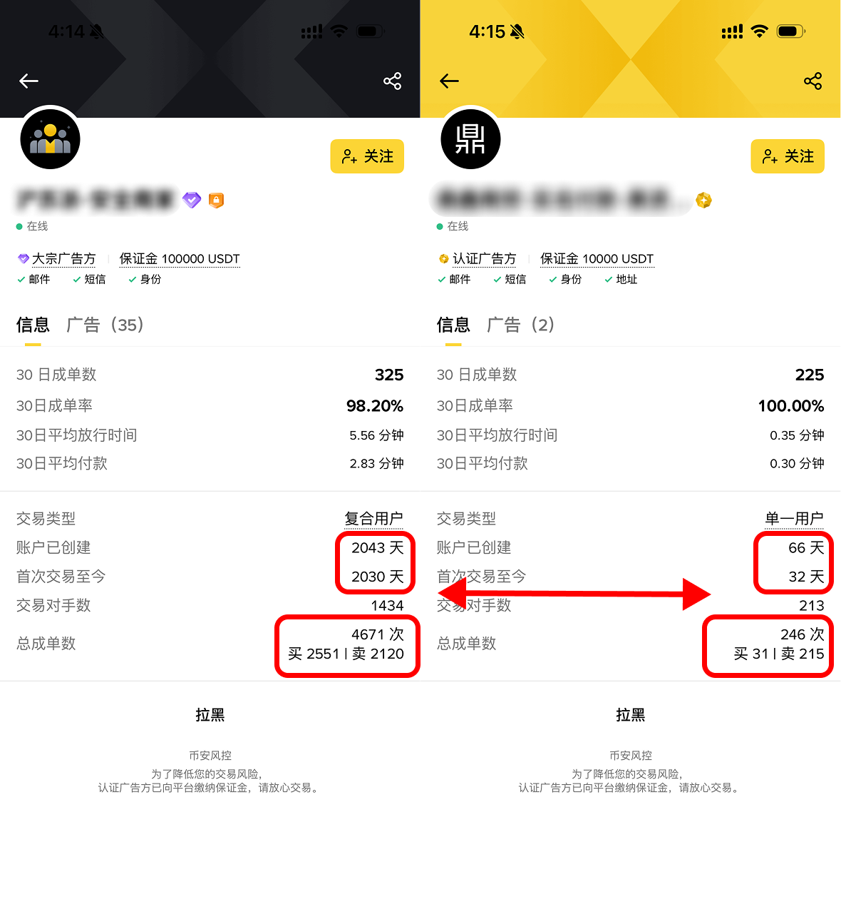

# 3.1 交易所入金：如何将人民币兑换为链上美元资产

[🔙 返回主指南](../README.md)

无论你打算投资美债、美股还是其他链上 RWA（真实世界资产），第一步都必须在合规的场所，将手中的人民币（CNY）兑换成加密世界的结算法币，通常是 **USDT** 或 **USDC**。

对于国内用户，最稳妥、最主流的渠道是借助大型中心化交易所的 **C2C**。
---

### 名词解释

1.  **C2C（Customer to Customer，个人对个人交易）**：
    *   **解释**：也叫 OTC（场外交易）。交易所只作为一个提供中介担保的平台。你购买稳定币时，是直接将人民币转账给平台认证的某个“商家”的个人账户，商家收到钱确认无误后，平台会将托管在系统里的稳定币释放到你的交易所账户中。
2.  **USDT（Tether USD）/ USDC（Circle USD）**：
    *   **解释**：这是加密世界最常见的两种**美元稳定币**，分别由 Tether 和 Circle 担保发行。它们的发行方在传统金融世界里持有一比一的美元现金或短期国债作为准备金，因此它们的价格与美元维持 1:1 的刚性挂钩。持有 1 枚 USDT，就等于持有 1 美元。
---

### 实操步骤

#### 第一步：注册账户与实名认证（KYC）

1.  **选择头部平台**：为了避免遭遇“杀猪盘”或交易所破产跑路，**必须**选择行业内生存时间长、口碑好、能定时发布资金储备证明的一线交易所。切勿使用任何非主流、高收益噱头的小交易所。[CoinMarketCap](https://coinmarketcap.com/zh/rankings/exchanges/) 是一个加密货币数据聚合平台，汇总了各大代币的价格信息以及交易所的成交量、资产情况。确保使用口碑好，排名靠前的交易所，并将资产分散存储可以最大程度防止单一交易所资金问题导致的损失。

撰写本指南时 CoinMarketCap 收录的以现货计算全球前十的中心化交易所列表。请注意：本指南不对任何交易所的安全性做背书。

2.  **完成KYC认证**：下载官方 App，注册后在安全中心点击“身份认证”，依次完成身份证拍照、本人人脸识别检测。必须认证到 **KYC 2（高级认证）** 以上级别，否则你将无法使用自选区交易。

#### 第二步：选择 C2C 商家

目前主流的中心化交易所均提供 C2C 渠道出入金。在App首页搜索 C2C 或点击相应的按钮即可使用该功能。

由于人民币的流向可以追溯，必要时也可以报警申请冻结人民币资金。你作为付款方，使用人民币买 USDT 风险相对较低。但如果你遇到劣质商家，你付钱的银行卡依然有被银行“反洗钱风控”非柜限制的可能。因此，**不建议使用“快捷买币”（系统会随机分配商家），而是主动评估选择靠谱的商家进行交易**。通常可以根据以下几条依据进行判断对方账户、资金是否安全。

1.  **商家的注册时间**：点击商家头像进入其主页。**首选注册时间长的老商家**。能在风控极其严苛的环境下存活越久的商家，说明其资金安全度和管理越完备。刚注册几个月、几十天的新商家，汇率再好也不建议交易。
2.  **考核商家的总成单量（信用规模）**：商家的历史总交易笔数，**建议在 3000 单以上**，上万单的更优。成单量过低，意味着其账户没有充分的可验证成单记录。
3.  **考核最近 30 天的成单率/成功率（履约稳定性）**：成单率**必须在 99% 以上**（最好在 99.5% 甚至 99.8% 以上）。成单率低于 98% 的商家，可能存在频繁取消订单、无法成功转账、账户被风控等问题。
4.  **考核官方认证标签（安全背书）**：在筛选列表中，优先选择带有“V 标”、“蓝标”或“神盾”、“Pro”等官方标识的商家。这些商家通常在交易所交纳了极高的保证金（通常几十万到上百万），违约和作恶的成本极高。
5.  **剔除“异常价格”商家**：市场上稳定币的兑换价基本一致，差距一般不会超过1%。如果在自选区里，某个商家的汇率明显比其他大商优惠的多，这可能是急于脱手问题资金。

可以对比左右两个商家的账户数据情况。左侧账户的创建时间和成单数量远大于右侧商家。且缴纳的保证金为 100000 USDT，远大于右侧 10000 USDT 的商家。因此与左侧商家交易的安全性更高。

部分交易所的 C2C 区提供了官方“神盾”、订单包赔等类型的资金安全担保，确保交易过程中不会出现涉诈、爆雷等问题，最大化保障你的加密货币与法币资金安全（图例为币安严选界面）。

#### 第三步：下单与付款

1.  **输入购买金额**：在选择靠谱的C2C商家后，点击买入，输入你要购买的金额即可。
2.  **选择合适的转账方式**：主流C2C交易通常支持**支付宝**、**微信**、**银行卡转账**等多种支付方式。建议优先选择你经常使用、资金沉淀时间较长且没有频繁大额快进快出的账户进行转账，这样可以大幅降低资金被风控冻结的概率，提高交易通过率。
3.  **切记备注保持空白**：转账时，无论用哪种支付方式，**交易备注、留言、附言栏必须保持完全空白**！千万不要填写“USDT”、”加密货币“、“代币”、“比特币”或“RWA”等任何相关或敏感字样。
4.  **严格执行同行同名转账**：付款时，你所使用的支付宝、微信或银行卡账户**实名姓名**，必须与你在交易所实名认证的**姓名完全一致**。严禁使用他人账户（包括亲友代为付款），否则会被认定为异常交易，商家有权拒收、锁币，甚至可能被平台风控和封禁账户。
5.  **配合商家资质审核（如有）**：有时出于合规和反洗钱要求，商家可能会要求你在App内部聊天中**截图展示付款账户的余额记录或历史流水**，以证明资金非异常流入。这属于正常的风控操作，只需如实配合即可，敏感信息可适当遮盖（如卡号末尾等）。

#### 第四步：完成交易

1.  **点击“我已付款”**：在手机网银将资金足额转入商家提供的收款卡后，返回交易所 App，点击 **“我已付款，通知卖家”** 按钮。
2.  **等待商家放币**：商家核查银行流水，确认收到款项后，通常会在 2 到 10 分钟内释放代币。此时，你购买的 USDT 就会安全到账至你的 **“资金账户”**（Funding Account）。

> ⚠️有的商家可能会在交易完成后，通过支付宝或微信聊天私下添加你的联系方式，邀请今后“直接合作”进行出入金。**务必高度警惕**：除非你非常了解对方、或现实中认识，**绝不要脱离交易所担保体系私下转账**。一旦绕开平台进行交易就没有任何安全保障，容易遭遇资金安全风险和诈骗。

