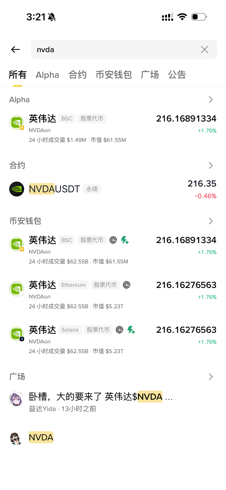
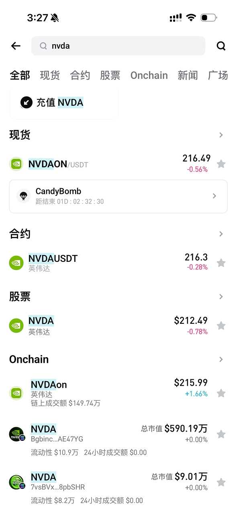
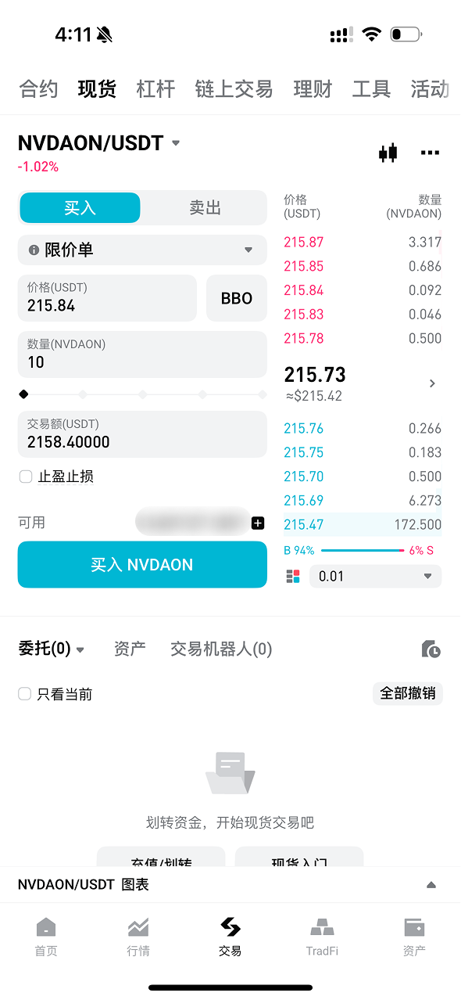

# 3.2 交易所购买 RWA 现货代币

[🔙 返回主指南](../README.md)

当入金完毕，持有 USDT 之后，就可以交易美股资产了。通常有两种方式可以将USDT兑换为各类美股代币资产，一种是通过中心化交易所；另外一种是通过链上去中心化交易所进行兑换。本节会优先介绍中心化交易所的方式。

---

### 名词解释

1. **现货交易（Spot Trading）**：
   * 不加任何杠杆、不借贷、不使用衍生品的纯代币实物交易。你有 100 USDT，就只能买 100 美元等值的 RWA 代币，买入后立刻交付，永久持有，最安全也最适合长期配置。
2. **限价单（Limit Order） 与 市价单（Market Order）**：
   * **限价单**：指定一个具体的价格，比如“当价格到 1.01 美元时买入”。只有当市场有人卖这个价时订单才会成交。
   * **市价单**：不指定价格，只输入购买价值多少USDT的代币，撮合系统会以当前排在最前面的卖单价立即成交。
3. **滑点（Slippage）**：指下单时看到的预估价格，与订单最终成交价格之间的价差。在一些成交量小、流动性差的代币中，如果使用市价单，由于卖盘深度不足，你的大额买单会造成价格大幅波动，导致你用远高于市场合理的价格成交。

4. **资金账户（Funding Account）**：
   * 资金账户主要用于充值、提现和 C2C 买卖币。比如你通过 C2C 买到 USDT 后，很多交易所会先把这笔 USDT 放在资金账户里。它更像一个“收付款账户”，不一定能直接用于现货下单。
5. **交易账户（Trading Account）**：
   * 交易账户是一个总称，通常指可以参与交易的账户区域。有些交易所会把现货、杠杆、合约统一放在“交易账户”下面；有些交易所会拆得更细。你真正下单前，要看清楚资金是否已经划转到对应的交易账户里。
6. **现货账户（Spot Account）**：
   * 现货账户专门用于买卖现货代币。你要购买 RWA 现货代币，就需要确保 USDT 在现货账户或可用于现货交易的交易账户里。买入成功后，RWA 代币也会显示在这个账户下。
7. **合约账户（Futures Account）**：
   * 合约账户用于永续合约等衍生品交易。这里的 USDT 通常是保证金，不是用来买入并持有现货代币。新手购买 RWA 现货时，不要把资金误划到合约账户。

---

### 实操步骤

#### 第一步：选择交易对

当你明确希望交易的美股之后，就可以进入交易所选择交易对了。这里我们以英伟达 NVDA 为例。

当你在交易所搜索美股代码 NVDA 时，可能会同时出现不同的入口，如下图所展示的Alpha、合约、币安钱包、现货、股票、Onchain等。它们看起来都和 `NVDA` 有关，但实际含义完全不同。

币安内搜索 `nvda` 的结果。可以看到同一个资产代码下，既有 Alpha/钱包里的 RWA 代币，也有 `NVDAUSDT` 永续合约。

Bitget 内搜索 `nvda` 的结果。不同入口背后的资产性质不同，不能只看名字相似就直接买入。

常见入口可以这样理解：

1. **现货 / Spot**：这是本节最优先考虑的入口。比如 `NVDAon/USDT`，通常表示你用 `USDT` 去买 `NVDAon` 这个 RWA 代币。买入后，你将通过这些托管方，间接持有对应的份额的美股。（NVDAon是 Ondo 发行的英伟达股票代币.市场上可能还会有其他的RWA发行方，如币安即将推出的bNVDA;xStocks 发行的 NVDAx等。请确保购买前你充分了解这些RWA托管发行方的资产储备和法务结构。）
2. **合约 / Futures / Perps**：比如 `NVDAUSDT` 永续合约，意思是用 USDT 作为保证金，交易英伟达价格涨跌。它不是现货，也不是代币持仓。你不会拥有任何 NVDA RWA 代币，也不能获得股票分红，只是在做多或做空价格。
3. **股票 / Stocks（币安等已接入券商通道的交易所）**：在 App 里买的是券商托管的美股或碎股，走 Nest → Alpaca 链路，不是链上 RWA 代币，也不能提到自托管钱包。结算以 USDC 为主，机制和费用与现货 RWA 不同，详见 [3.ex1 Binance 的股票交易机制](3.ex1%20Binance%20的股票交易机制是什么？.md)。
4. **Onchain / 钱包**：这类入口通常指链上代币，可能发行在 BSC、Ethereum、Solana 等不同网络上。RWA托管发行方的代币均最初在链上发行。部分中心化交易所会选择支持这些代币在其APP内部购买交易，以获取交易手续费收入。如何通过链上购买可以查阅下一节指南。
5. **Binance Alpha**：这是币安用来展示早期项目或链上热门资产的入口，可以理解成一个“观察区/发现区”。出现在 Alpha 里，不等于已经是币安主站正式现货，也不代表风险已经被完全过滤。Alpha 资产通常更早期，流动性和价格波动都可能更大。Alpha 本质是托管币安代替你进行链上操作，并间接记录在你的中心化交易所账户中。你并不实际持有这部分 Alpha 内的资产。 

实际操作时，先确认你想买的是**现货 RWA 代币**，而不是合约。如果你看到的是 `NVDAUSDT`，一般要先警惕，因为这类命名更常见于合约交易对；如果你看到的是 `NVDAON/USDT` 这类形式，才更接近“用 USDT 购买某个 RWA 代币”的现货逻辑。

如果你正在使用的交易所没有对应美股的现货 RWA 代币，不要为了“买到同名标的”而改去买合约或杠杆产品。更稳妥的做法，是先确认哪些头部交易所支持该现货代币，再把 USDT 转到支持交易的交易所。不同交易所之间转移资产时，务必确认币种、网络和充值地址完全一致，具体操作可以参考 [4.6 如何在不同交易所之间转移资产](../4_FAQ/4.6%20如何在不同交易所之间转移资产.md)。

> [!合约及衍生品风险]
> 新手一定要先分清楚：**现货是买入并持有代币，合约只是围绕价格涨跌做交易**。合约最吸引人的地方，是可以做多、做空，也可以加杠杆。比如你只拿 100 USDT 做保证金，却开出 300 USDT、500 USDT 甚至更大的仓位。方向对了收益会被放大；方向错了亏损也会同步放大。一旦亏损触及平台的维持保证金要求，系统会直接强制平仓，也就是常说的“爆仓”。所以，如果你的目标是长期配置美股、美债这类资产，建议只使用现货交易，不要使用合约、衍生品等工具。尤其不要在没理解保证金、强平价格、资金费率和止损规则之前，用高杠杆去交易。对新手来说，合约不是“高级版现货”，而是完全不同的一套高风险玩法。

#### 第二步：现货交易

在确认自己进入的是现货交易对之后，就可以进行具体下单了。许多 RWA 代币的成交量没有主流加密货币那么大，盘口深度也可能比较浅，所以不建议直接用市价单。

图例：现货交易页面通常会显示买卖盘口、限价/市价委托、价格、数量和可用余额。下单前请再次确认页面属于现货交易，而不是合约交易。

1. **优先使用限价单**：选择“限价委托”（Limit Order）。。限价单可以让你自己指定成交价格，避免因为流动性不足，用明显偏高的价格买入。
2. **填写买入价格**：在价格框（Price）中输入你能接受的价格。可以参考盘口里的买一、卖一价格，也可以参考底层美股或 RWA 项目页面显示的净值，不要只看交易所当前跳动的最新价。
3. **填写买入金额**：在数量或金额框中输入你准备投入的 USDT 数量或准备购买的代币数量。第一次买入建议先用小金额测试，确认成交、到账和持仓显示都正常后，再考虑追加。
4. **提交并等待成交**：提交订单前，再核对一遍交易对、价格、数量和手续费。限价单可能不会立即成交，只有市场价格触及你设置的价格时，订单才会被撮合。

#### 第三步：检查持仓

1. **查看当前持仓**：交易成功后，挂单会从“当前委托”消失。此时点击交易所底部的“资产”（Assets），在“交易账户”下，你便能清晰地看到自己所持有的 RWA 现货代币数量与实时净值。

---

### ⚠️ 交易所托管风险提示

虽然通过交易所购买方式相对简单，无需了解链上钱包操作相关的知识，但你必须清楚：**你通过交易所购买的RWA代币只是持仓数字，真实的代币所有权实际上被中心化交易所代持了。**

如果交易所不幸遭遇黑客攻击、资金链断裂暴雷（如2022年FTX破产），或者面临某些严厉的突发监管。你的资产可能会因为交易所的清算而被无限期冻结，面临血本无归的命运。在 Web3 行业里有一句永恒的铁律：**“Not your keys, not your coins”（没有私钥，资产就不是你的）**。

如果你想获得这笔美股代币的**所有权**，那么你必须学习下一节的内容：如何使用 **自托管钱包** 在链上保管资产。
