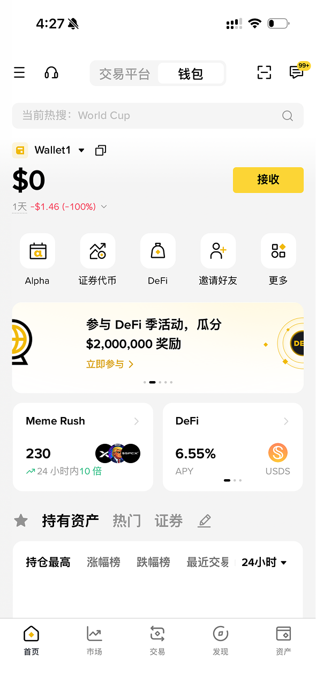
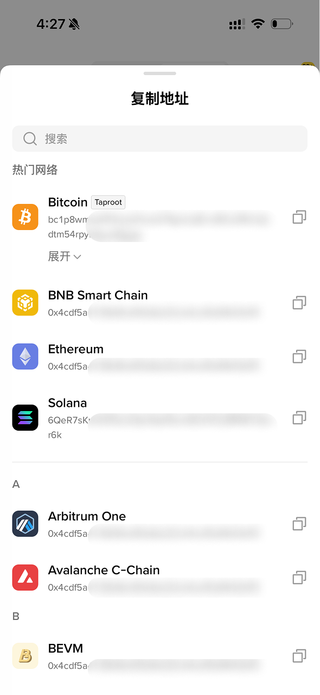
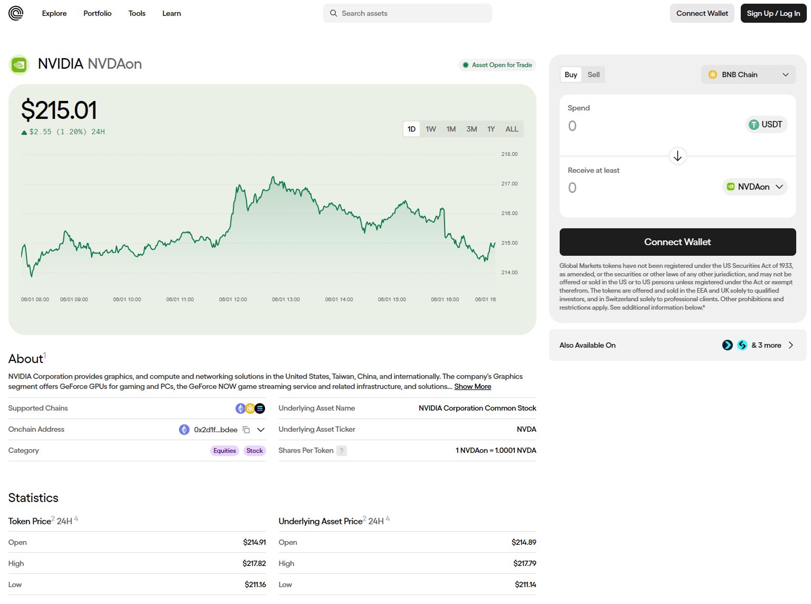

# 3.3 链上自托管 RWA 代币

[🔙 返回主指南](../README.md)

这是最硬核、最能体现 Web3 精神和去中心化逻辑的参与方式。通过这种方式，你的 RWA（真实世界资产）代币将不依赖任何中心化交易所或中间商，完全躺在你在链上的私人账户里。只要你保管好私钥，没有任何机构能冻结、挪用或者强行没收你的资产。

本节我们将手把手、事无巨细地带你依次完成钱包创建、资产提现（Withdraw）和链上铸造配置。

---

### 名词解释

1. **自托管钱包（Self-Custodial Wallet）**：
   * 也叫非托管钱包、EOA钱包等。与交易所（托管钱包）不同，自托管钱包的控制权（私钥）完全由你本人持有。典型的代表如 **MetaMask（小狐狸钱包）**、或 交易所内部提供的EOA钱包，如Binance Wallet或 OKX Web3 Wallet。
2. **助记词（Seed Phrase）/ 私钥（PrivateKey）**：
   * 通常由 12 个或 24 个英文单词组成，这些单词来自 [BIP-39 规定的 2048 个英文单词表](https://github.com/bitcoin/bips/blob/master/bip-0039/english.txt)，钱包会从中随机组合生成助记词。具体组合数量取决于助记词长度：12 个助记词约有 \(2048^{12} \approx 5.44 \times 10^{39}\) 种可能；24 个助记词约有 \(2048^{24} \approx 2.96 \times 10^{79}\) 种可能。**助记词就是你的资产，谁拿到了它，谁就拥有了你的卡和里面所有的钱**。在区块链上，资产只认助记词不认人。
3. **Gas Fee（燃气费/链上交易手续费）**：
   * 区块链网络需要计算节点来维持运转。因此，只要你在链上进行转账、购买、授权等任何操作，都必须支付少量手续费。Gas Fee 必须用目标公链的原生代币支付（例如：以太坊 Ethereum 网络用 **ETH** 支付；Polygon 网络用 **POL** 支付；Arbitrum 二层网络用 **ETH** 支付）。
4. **公链网络（Mainnet）**：
   * 数字资产的区块链公开账本。RWA 代币通常发行在以太坊（Ethereum）主网，或者更为便宜、高效的二层网络（Layer 2）或侧链上，如 **Arbitrum**、**Base** 或 **BNB** 。

---

### 实操步骤

#### 第一步：创建自托管钱包并备份账户控制权（最关键保障）

1. **选择钱包类型**：
   * **助记词钱包**：例如 **MetaMask（小狐狸钱包）**。这类钱包会给你一组 12 个或 24 个英文单词，也就是助记词。谁掌握助记词，谁就掌握钱包里的资产。
   * **MPC / 无私钥钱包**：例如 **Binance Wallet**、OKX Web3 Wallet 等。它们不会直接让你手抄完整私钥，而是通过多方安全计算（MPC）把私钥拆成多个片段保存，使用体验更接近普通 App，对新手相对方便一些。
2. **理解 MPC 钱包的控制逻辑**：以常见的 2/3 模式为例，钱包会把私钥拆成三份片段，分别保存在云端备份、交易所服务器和你的设备本地。三份里面只要能拿到其中两份，就可以恢复钱包并获得资产控制权。这种模式降低了单点丢失的风险，但也意味着你仍然要保护好交易所账户、云端账号和本地设备。
3. **创建新钱包**：如果使用 MetaMask 这类助记词钱包，可以在浏览器（Chrome / Brave）官方应用商店下载插件，打开后选择“创建新钱包”，并设置一个用于本地解锁的强密码。如果使用 Binance Wallet 或 OKX Web3 Wallet，可以在交易所 App 内按提示创建 Web3 钱包，并完成云端备份或设备验证。

图例：Binance App 顶部可以在“交易平台”和“钱包”之间切换。点击“钱包”后，就能看到你自己的 Web3 钱包详情。初次进入时，按照 App 提示创建钱包并完成备份即可。

4. **备份助记词或 MPC 恢复方式**：
   * 如果钱包显示 12 个或 24 个英文单词，这就是你的**助记词**。**严禁截图**，**严禁保存在任何联网文件或云盘中**，**严禁发送给微信、QQ 或电报里的任何人**。
   * 更稳妥的方法是拿纸笔手抄两份，检查无误后，分别放在两个不同的安全位置。
   * 如果使用 MPC 钱包，也不要忽略备份、2FA绑定等步骤。云端备份密码、交易所账户安全验证、本地设备都关系到你未来能否恢复钱包。
5. **理解钱包地址**：钱包创建完成后，App 会为你生成一个或多个“钱包地址”。它可以理解成链上的收款账号，别人给你转账、你从交易所提现到链上，都需要填写这个地址。钱包地址可以公开给别人收款，但助记词、私钥、MPC 备份密码绝对不能公开。
6. **验证备份并完成创建**：助记词钱包通常会要求你按顺序点击单词完成验证；MPC 钱包通常会要求完成云端备份、设备验证或安全问题确认。只有确认恢复方式可用后，才算真正创建完成。

#### 第二步：从交易所向链上自托管钱包提现（Withdraw）

现在，你需要将本金（如 USDT）和手续费（如 ETH）从中心化交易所提现到你的钱包地址。

1. **复制钱包接收地址**：
   * 打开你刚才创建的自托管钱包（例如 MetaMask）。
   * 在主界面顶部点击复制你的“Account 地址”（以 **`0x` 开头的 42 位长字符串**，例如 `0x1234...abcd`）。这个地址在所有主流的 EVM 网络上都是完全通用的。

   

   钱包会按不同区块链网络展示接收地址。提现前必须确认你复制的是目标网络对应的地址，并且交易所提现网络也选择同一条链。

   > [!NOTE]
   > 现在主流钱包大多是 **Hierarchical Deterministic Wallet（HD Wallet，分层确定性钱包）**。即一组助记词可以派生出多个私钥，并管理不同区块链网络上的钱包地址。
   >
   > 不同链的钱包地址格式可能不一样。基于以太坊虚拟机（EVM）的网络，如 Ethereum、BNB Smart Chain、Base、Arbitrum 等，通常共用 `0x` 开头的地址；在同一组助记词或私钥下，这些 EVM 网络里的钱包地址通常也是相同的。而比特币网络的地址通常以 `bc1q`、`bc1p` 等开头。
   >
   > 地址不同或网络不同，不能直接互相转账。例如，不能把只支持 EVM 网络的资产直接转到比特币地址。但同一组助记词可以在钱包软件里同时管理多条链上的资产，所以你看到的是“一个钱包管理多个网络”，不是“所有网络地址都能互通”。

2. **购买 Gas Fee（手续费本金）**：
   * 由于链上交互必须消耗手续费，除了你的稳定币（USDT）外，你**必须**在交易所额外购买少量的公链原生代币（以 BNB 链为例，购买价值一些 **BNB**代币，BNB网络为侧链，网络手续费相对较低，单笔操作费用大约为0.01美元）。
3. **提币操作（极其关键：网络对齐）**：
   * **注意**：提币时，选择的**“提现网络”**（Withdrawal Network）必须与你的钱包网络以及目标 RWA 项目支持的网络完全对齐。例如，你希望在BNB链上购买NVDAon，则必须保证你的USDT、BNB都提币到BNB网络。如果网络选错，资产可能会永久丢失！
   * 提现 BNB（Gas Fee）：粘贴钱包地址，提现网络选择 **BNB Smart Chain**（相比以太坊主网手续费极便宜）。
   * 提现 USDT（购买本金）：粘贴钱包地址，提现网络同样选择 **BNB Smart Chain**。
4. **核对并到账**：通常 2 到 10 分钟后提币完成。打开钱包并将网络切换至 BNB Smart Chain，你将能看到到账的 BNB 与 USDT。

#### 第三步：访问 RWA 项目官方网站完成链上交互（DApp 操作）

下面我们以 Ondo Finance 的英伟达 RWA 代币 **NVDAon** 为例，演示如何通过项目官网完成链上交互。示例页面为 [Ondo Finance 的 NVDAon 资产页](https://app.ondo.finance/assets/nvdaon)，示例网络使用 **BNB Smart Chain**。

Ondo Finance 的 `NVDAon` 资产页面。进入页面后，应先确认资产名称、支持网络和合约信息，再进行连接钱包、授权或兑换操作。

1. **输入官方安全域名**：为了防止在搜索引擎中误点击广告钓鱼网站，请务必直接访问项目官网或从官方社交媒体（如 Twitter 认证账号）中获取链接。以本例来说，先打开 `https://app.ondo.finance/assets/nvdaon`，确认页面显示的是 `NVDAon`。
2. **连接钱包（Connect Wallet）**：
   * 点击网站右上角的 **“Connect Wallet”**。
   * 在弹出的自托管钱包窗口中，点击“批准”并“切换网络”至 **BNB Smart Chain**。如果钱包没有自动切换网络，需要手动确认当前网络是否为 BNB Smart Chain。
3. **资产授权（Approve）**：
   * 在交互界面上，选择你要用什么资产（如 USDT）兑换什么代币（本例为 `NVDAon`），并输入数量。
   * 首次交易必须先点击 **“Approve USDT”**（授权），这是授予智能合约移动你指定数量 USDT 的安全限额（建议只授权你本次想兑换的金额，尽量避免无上限授权）。
   * 在钱包弹窗中点击确认授权，扣除极少的 Gas Fee。
4. **执行铸造/兑换（Mint/Swap）**：
   * 授权成功后，点击 **“Swap”** 或 **“Mint”**。
   * 在钱包里确认并签署最终交易，再次扣除一笔极少的 Gas Fee，等待链上确认。
5. **导入合约地址显示资产**：
   * 在官网或区块链浏览器上复制该代币的**合约地址（Contract Address）**。
   * 打开钱包，点击底部“Import Tokens”（导入代币）或“+”，粘贴该合约地址。钱包会自动识别代币符号，点击确认后，你所持有的自托管 RWA 资产便会显示出来。

除了项目官网，有些 RWA 代币也可以通过 PancakeSwap、Uniswap 等 DEX（去中心化交易所）购买。但在 DEX 上搜索代币时，容易遇到假币和同名仿盘。无论在哪个 DEX 交易，都不要只看代币名称或 Logo，必须把 DEX 中显示的代币合约地址（CA）与项目官网公布的合约地址核对一致后，再进行兑换。
