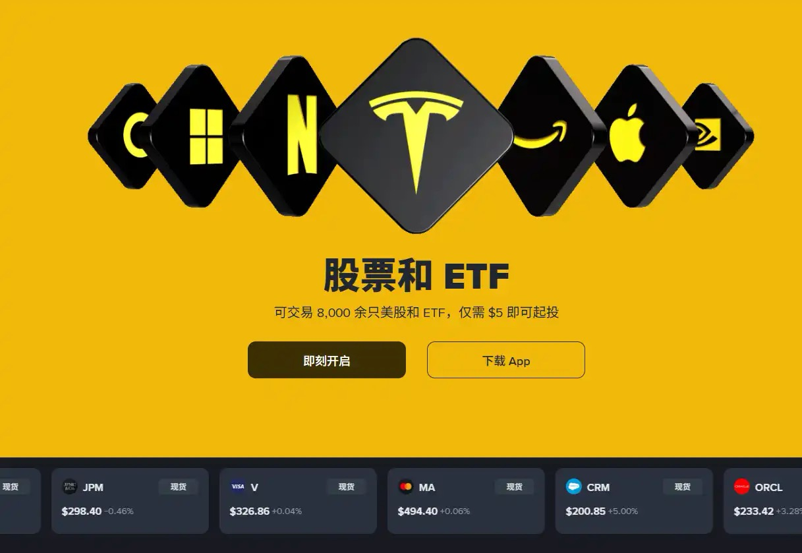
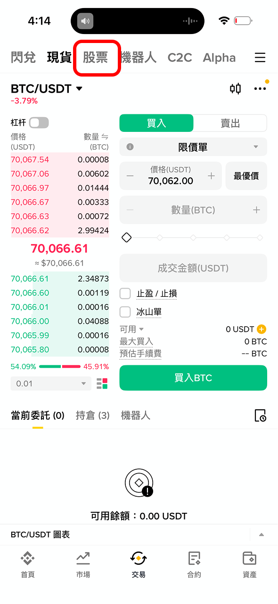
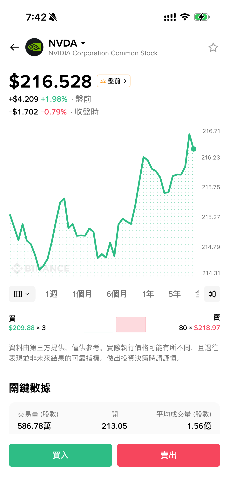
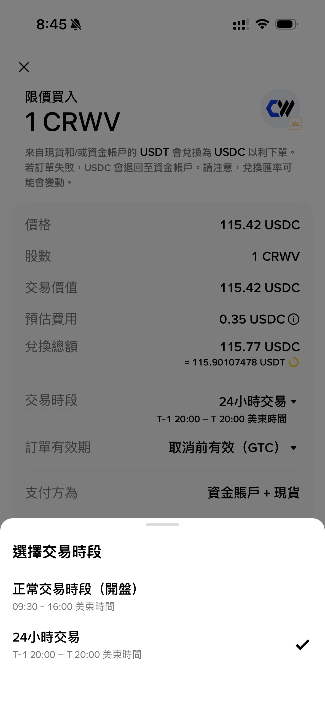
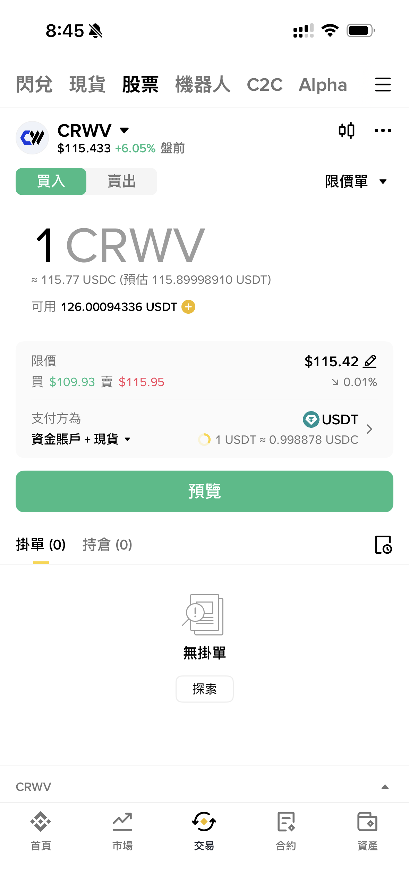
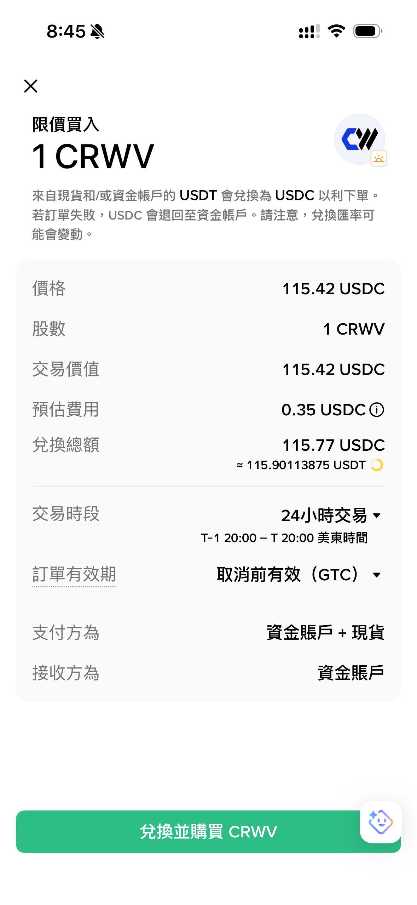
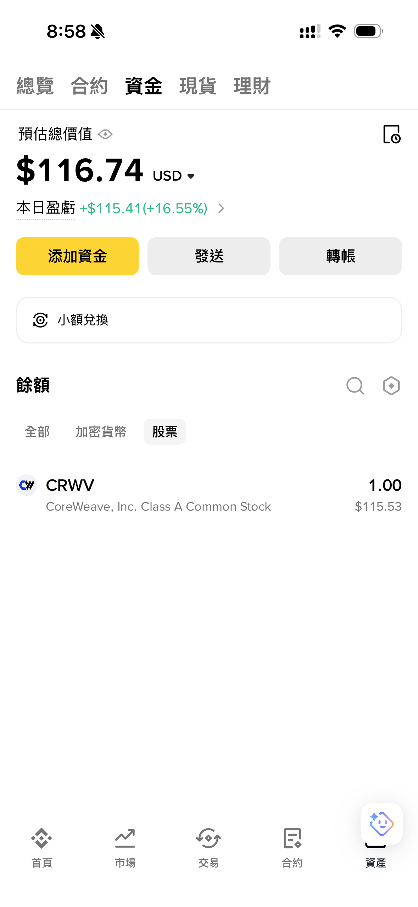

# 3.ex1 Binance 的股票交易机制是什么？

[🔙 返回主指南](../README.md)

Binance 在2026年6月1日上线了美股板块。把超过8000+支美股接进了 App。例如搜索 `NVDA` 时，除了 RWA 现货、合约、Alpha，还会多出一个「股票」或「传统金融」入口。很多人第一次看到这个入口，会以为它和 `NVDAon/USDT` 是一回事，其实不是。

Binance 的股票交易走的是传统券商通道：你在 App 里下单，订单经介绍经纪商转给美国券商执行，最后对应的是券商托管的美股权益，不是链上代币，也不能像 RWA 那样提到自己的钱包里。

如果你在 [3.2 交易所购买 RWA 现货代币](3.2%20交易所购买%20RWA%20现货代币.md) 里已经看过 NVDA 的几种入口，可以把币安「股票」单独记成一种渠道：**实际上是在买美股，但股票和加密货币资产会一起显示在 Binance 账户里。**

---


### 如何开启股票交易？


打开 Binance App，在「交易」页面的顶部，可以看到「股票」入口。最低 **5 USDC** 起投，门槛对新手比较友好。





<sub>Binance 把美股和加密货币放在同一个 App 里。这和链上 RWA 代币是不同的产品线。</sub>

**如果你找不到「股票」入口，可以检查以下两点：**

1. **App未更新到最新版**：美股板块是新上的功能，旧版本 App 里往往不会出现「股票」Tab，先到应用商店检查更新。
2. **App语言不要选简体中文**：应该是出于担忧合规问题，币安目前简体中文界面不显示股票。可在设置里把语言改成 **繁体中文**。

---

### 币安美股股票交易界面


以 `NVDA` 为例，进入股票详情页后，看到的是行情折线图、公司股票数据和买入/卖出按钮，界面风格相比加密货币的行情要更加简洁。



<sub> NVDA「股票」交易界面。</sub>


---


### 交易的核心结构

一笔股票订单，大致沿下面这条链路走完：

```
用户 → Binance App → Nest Trading → Alpaca Securities → 美股市场
```

各层分工可以这样理解：

| 主体 | 角色 |
|------|------|
| **Binance** | 前端入口：搜索、行情、下单、资产展示，把股票和加密资产放在同一套账户体验里。 |
| **Nest Trading Limited** | 介绍经纪商（Introducing Broker），把用户在 App 里的指令转给后面的美国证券经纪商。它是 **Binance 体系内的实体**，在 **阿布扎比 ADGM** 框架下持牌，受 **阿联酋（UAE）** 监管。 |
| **Alpaca Securities LLC** | **美国券商**，负责美股的 **执行、清算、结算和托管**。你最终持有的证券权益，落在 Alpaca 侧的券商账户体系里，而不是 Binance 的链上钱包。 |

**交易流程如下：**

1. 你在 Binance App 上进行股票搜索、下单等操作。
2. Binance App 会将你的指令发送给 Nest Trading Limited（介绍经纪商）。
3. Nest Trading Limited 再把指令转交给美国本土券商 Alpaca Securities LLC。
4. Alpaca Securities 负责具体股票的撮合成交、清算结算和资产托管。
5. 最终你在 Binance 账户内看到的「股票资产」对应为 Alpaca 实际美股权益。
   

---


### 交易手续费如何？

Binance 美股交易为**零佣金（zero commission）**，但还要算上 **平台费** ，并不是「完全免费」。

平台费规则：

- 单笔订单金额 **不超过 350 美元**：平台费 **0.35 美元**；
- 单笔订单金额 **超过 350 美元**：平台费为成交金额的 **0.1%**。

---


### 交易时段：周一至周五 24小时交易


App 里会让你在「正常交易时段」和「24 小时交易」之间二选一，**目前并不是像RWA代币或加密货币一样的 7×24不间断交易**。

- **正常交易时段**：美股常规开盘时间（美东 09:30–16:00）。
- **24 小时交易（界面文案）**：通常对应美东 **T-1 20:00 至 T 日 20:00** 这类夜盘、盘前、盘后的时间段。这些时间段流动性较差。




<sub>币安美股交易时间段选择</sub>

---

### 在币安商持有美股能拿到股息吗？


若持仓标的本身有分红计划，Binance 会将扣税后的分红以USDC的形式转入你的资金账户。

这和链上 RWA 的分红计入兑换比率，净值上涨、无现金分红的逻辑不同。

---

### 实操示例：用 USDT 限价买入 CRWV

下面以 `CRWV` 为例，展示完整的下单流程。

**第一步：在「股票」交易页填写订单**

进入「交易」→「股票」，选择希望购买的股票，限价买入，输入数量和价格。支付方式通常会显示「资金账户 + 现货账户」。



<sub>即使账户里是 USDT，页面也会先显示预估兑换后的 USDC 金额。当前如果是盘前时段，行情标签会显示「盘前」。</sub>

**第二步：预览订单，确认 USDT 会先换成 USDC**

点「预览」后，页面会明确提示：现货账户和/或资金账户里的 USDT，会先兑换成 USDC 再下单。如果订单失败，USDC 会退回资金账户。这里还能看到预估平台费、交易时段和订单有效期。



<sub>1 CRWV 约 115.42 USDC，预估平台费 0.35 USDC。底部是「兑换并购买」，不是加密现货意义上的直接币币成交。</sub>

**第三步：选择交易时段并下单**

在「正常交易时段」与「24 小时交易」之间选择。若你接受非盘中流动性风险，可选延长窗口；若希望和常规美股盘中一致，选正常时段即可。

所以「买1股 CRWV」的实际路径是：**USDT（或其他币）→ USDC → 买入股票 → 扣平台费**。

---

### 买入后在哪里看持仓

成交后，股票会显示在 Binance 的**资金账户**中。把筛选切到「股票」，就能看到例如 `CRWV` 这类持仓，名称会显示完整的公司名。



<sub>CRWV 显示为 CoreWeave, Inc. Class A Common Stock。</sub>

---

