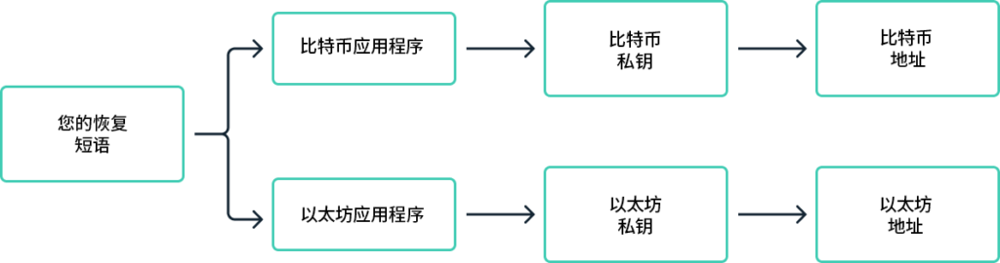
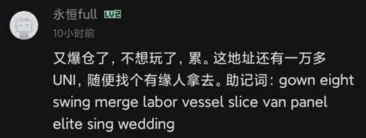
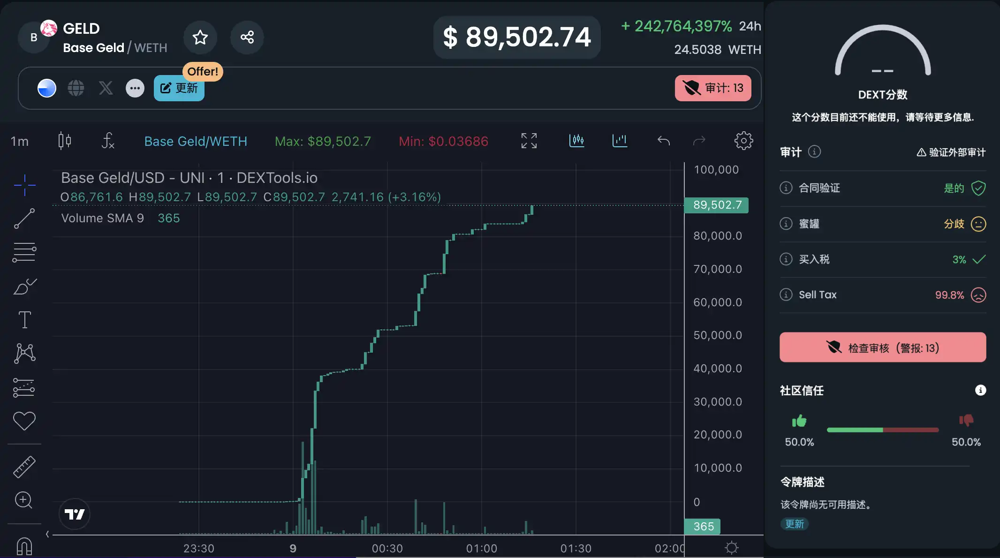

# Web3 安全交互准则：如何保护你的数字资产

[🏠 返回主指南](../README.md)

Web3 基于区块链技术，利用其去中心化和不可篡改的特点，确保了系统的整体安全性。然而，这种技术的另一面也带来了终端使用上的安全风险。在 Web3 中，一些在传统金融机构中常见的小错误，可能会导致不可挽回的资产损失。
---

## 理解区块链钱包的本质

在 Web3 进行安全交互的第一步是理解钱包的基本原理。区块链钱包（也称为链上钱包）并不直接存储你的代币，而是存储了一套能够让你安全访问分布式账本记录的工具。

你可以将区块链钱包类比为“银行账户”：
- **公钥/钱包地址**：相当于银行账号。它是公开信息，用于接收加密货币。
- **私钥**：相当于银行卡密码，但重要性远超密码。**私钥的持有者拥有对该钱包内所有资产的完全控制权。** 由于地址是由私钥计算得出的，持有私钥即相当于同时持有了“银行卡 + 密码”。

### 助记词（Seed Phrase）
为了方便记忆，目前广泛采用分层确定性钱包（HD 钱包）方案，将复杂的私钥转化为 12 或 24 个英文单词，即助记词。

**核心准则：泄露助记词等同于泄露该助记词下所有钱包的控制权。**

---

## 常见安全案例分析

### 1. 私钥与助记词的泄露
这是资产丢失最常见的原因。常见的泄露场景包括：
- **物理遗失**：未妥善备份，导致设备损坏后资产永久无法访问。
- **社交工程**：骗子冒充官方技术支持，要求共享助记词以“协助解决问题”。
- **云端存储风险**：将助记词存在 iCloud、微信、网盘等联网处。一旦这些账号被盗，链上资产也将面临风险。建议大额资产的助记词采用物理离线存储（如抄在纸上）。
- **恶意应用**：下载了非官方渠道的假钱包应用，导致助记词在生成或导入时被恶意开发者窃取。

### 2. 链上合约风险
智能合约对普通用户来说往往是一个“黑箱”，代码中的漏洞或恶意脚本具有极强的隐蔽性。
- **授权风险**：在 DApp 交互时，随意授权未知合约访问你的资产。
- **助记词钓鱼**：骗子有意泄露一个存有高价值代币的钱包助记词，引诱用户导入。用户发现钱包内有钱但没 Gas 费，一旦转入原生代币作为 Gas，会被脚本立即转走。

- **貔貅盘（HoneyPot）**：指一种只能买入而无法卖出的代币。黑客在合约代码中设置了后门（如极高的卖出税或白名单限制），导致投资者被套牢。

### 3. 虚假信息钓鱼
攻击者通过伪造官方渠道诱导用户进行不安全操作：
- **假推特账号**：使用与官方账号极度相似的用户名（如一字之差）发布虚假链接。
- **盗取官方账号**：黑客攻破官方推特或 Discord 发布“限时空投”等诱导信息。
- **谷歌竞价广告**：在搜索结果顶部投放指向钓鱼网站的广告链接。

### 4. 木马与劫持攻击
- **私钥扫描木马**：恶意程序潜伏在设备中，扫描文件、截图记录或碰撞钱包密码。
- **剪切板攻击**：监控剪切板，当你复制钱包地址时，恶意程序将其替换为黑客的地址。**转账前务必核对收款地址。**

---