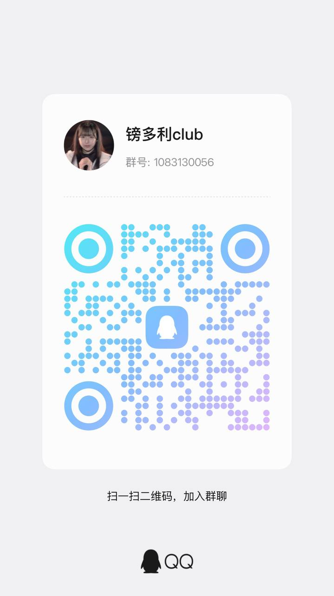

# 新生代的资产配置指南：通过 Web3 与 RWA 走向全球市场

**作者：[新鵺不亏钱](https://space.bilibili.com/445605)**

在当下的环境里，传统资金出海渠道的门槛正在肉眼可见地变高，监管也日益收紧。普通人想要合规、顺畅地投资海外资产，阻力越来越大。这篇指南从实用主义的角度出发，客观聊聊如何通过借助 RWA 这条相对低门槛的路径，来完成全球资产配置。

如果这篇指南对你有所启发，欢迎 Star 或关注我的 B 站账号。也可以加入下面的私域交流区，后续关于 RWA、美股代币、Web3 工具的更新和讨论会优先同步在那里。

- QQ 群：扫描下方二维码加入
- Discord：[镑多利 Labs](https://discord.gg/MwUQFkH4Cx)

**指南中的观点皆为个人主观看法，不构成任何财务建议。**

## 详细指南目录

### 0. 前言

### 1. 传统渠道的现状与困境
- [1.1 还有合规投资美股的渠道吗？有什么局限？](1_传统渠道的现状与困境/1.1%20还有合规投资美股的渠道吗？有什么局限？.md)
- [1.2 从“存量投资者证明”时代到“全面清退”还有多久？](1_传统渠道的现状与困境/1.2%20从“存量投资者证明”时代到“全面清退”还有多久？.md)

### 2. Web3 与 RWA 核心指南
- [2.1 加密货币、或者RWA是骗局吗？](2_Web3与RWA核心指南/2.1%20加密货币、或者RWA是骗局吗？.md)
- [2.2 RWA究竟是什么？发行机制如何？](2_Web3与RWA核心指南/2.2%20RWA究竟是什么？发行机制如何？.md)
- [2.3 美股RWA代币价值锚定是如何实现的？](2_Web3与RWA核心指南/2.3%20美股RWA代币价值锚定是如何实现的？.md)
- [2.4 前置风险披露](2_Web3与RWA核心指南/2.4%20前置风险披露.md)
- [2.5 关于资产托管的辩证思考](2_Web3与RWA核心指南/2.5%20关于资产托管的辩证思考.md)

### 3. RWA 投资美股实操教程
- [3.0 前提条件](3_RWA投资美股实操教程/3.0%20前提条件.md)
- [3.1 交易所入金：如何将人民币兑换为链上美元资产](3_RWA投资美股实操教程/3.1%20交易所入金：如何将人民币兑换为链上美元资产.md)
- [3.2 交易所购买 RWA 现货代币](3_RWA投资美股实操教程/3.2%20交易所购买%20RWA%20现货代币.md)
- [3.3 链上自托管 RWA 代币](3_RWA投资美股实操教程/3.3%20链上自托管%20RWA%20代币.md)
- [3.4 交易所出金：如何将链上美元资产兑换为人民币](3_RWA投资美股实操教程/3.4%20交易所出金：如何将链上美元资产兑换为人民币.md)
- [3.ex1 Binance 的股票交易机制是什么？](3_RWA投资美股实操教程/3.ex1%20Binance%20的股票交易机制是什么？.md)

### 4. FAQ
- [4.1 什么是永续合约（Perps）？资金费率又是什么？](4_FAQ/4.1%20永续合约与资金费率.md)
- [4.2 Web3 安全交互准则：如何保护你的数字资产](4_FAQ/4.2%20Web3安全交互准则.md)
- [4.3 加密货币法律案例](4_FAQ/4.3%20加密货币法律案例.md)
- [4.4 Web3 钱包使用指南](4_FAQ/4.4%20Web3钱包使用指南.md)
- [4.5 RWA 代币分红机制](4_FAQ/4.5%20RWA代币分红机制.md)
- [4.6 如何在不同交易所之间转移资产](4_FAQ/4.6%20如何在不同交易所之间转移资产.md)

---

## 为什么要投资、交易？是不是亏钱陷阱？

站在 2026 年这个时间节点，财富迁移和共识转变的速度已经非同寻常，而资产价格和交易是这种迁移的最直接载体。金融市场是大部分人所能体会到的对认知和价值观进行全面评判的唯一机会。他人的评价可能会夹杂非常多的利益考量和主观情绪。每个人都希望他人做对自己有利的事情。而资本市场中的盈亏是亿万人的观点中抽象聚合出来最客观的、最量化的答案。不接纳、拥抱这种变化无异于固步自封，放弃一种评判自我认知，了解世界发展变化的方式。

## 我只有几千/几万块钱，要考虑投资/交易吗？

投资或交易并没有资金门槛，只要是短期不用的闲钱就可以用于投资。年轻或是资金体量小并不是劣势，相反，这正是你最大的资本——试错成本极其低廉。

大学生损失生活费和工作十年后损失现金流带来的痛苦是相似的，但弥补损失所付出的劳动力代价是完全不同的。没有人能不犯错，在金融市场这个混沌的地方更是如此。即使是巴菲特、达利欧这些大咖，只要保持做决策，就永远有错的时候。犯错并从错误中学习，永远是越早越好的。

当然，这并不是鼓励你去盲目赌博。当劳动回报的收益远大于资产回报的时候，好好工作搬砖，积累资产才是正道。

## 投资A股不好吗？为什么要投资其他资产？

投资或者交易什么类型的资产并没有绝对的答案。但对于个体来说，了解并多元化投资渠道能在关键时刻为你打开更多的可能性。

在日本90年代时，按部就班、循规蹈矩进行日本股票、房地产投资的日本人都经历了泡沫破裂所带来的巨大痛苦。而同一时间拥抱美股或工作与新兴市场相关的日本人则未受到影响。比如在上海日企工作、购置房产的日本人就完整吃到了中国城市化发展所带来的红利。

在我们的日常生活中，买房、买A股应该也是大部分人的资产配置路径。面对未知与不确定性，积极去拓展边际是合理且有益的。

---
